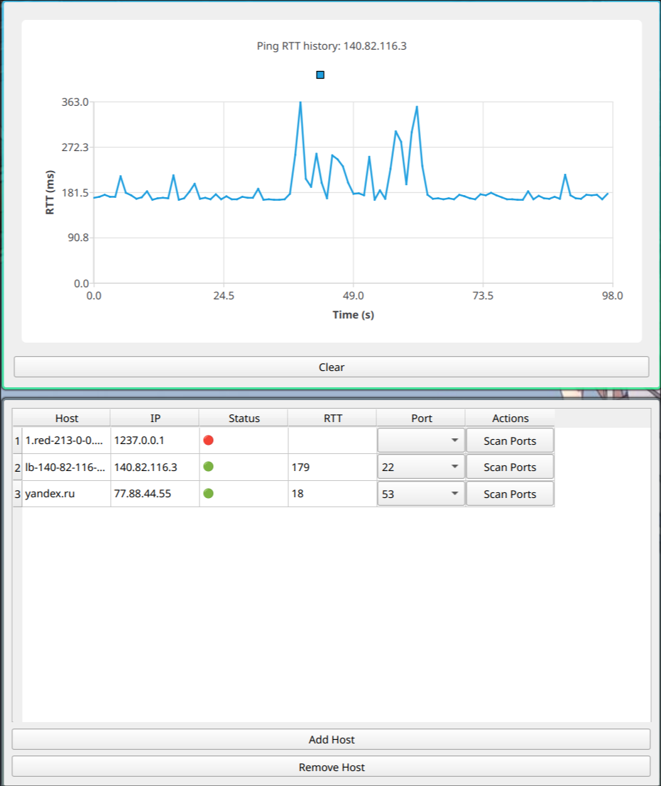
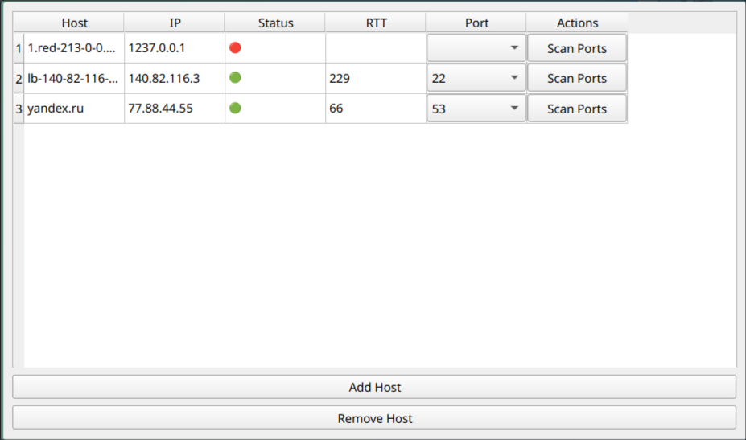

# Panic — Мониторинг сети и анализ хостов

[](https://opensource.org/licenses/MIT)
[](https://en.cppreference.com/)
[]()

**Panic** — это мощная утилита для мониторинга сетей, написанная на C++, предназначенная для системных администраторов, сетевых инженеров и специалистов по безопасности. Программа предоставляет инструменты для отслеживания доступности хостов, сканирования портов и визуализации задержек.

## ✨ Основные возможности

- **Мониторинг доступности**: Постоянная проверка хостов TCP ping
- **Сканер портов**: Обнаружение открытых портов с настраиваемыми диапазонами
- **Графики задержек**: Визуализация времени отклика сервера в реальном времени
- **Гибкие настройки**: Настраиваемые таймауты, интервалы и количество потоков

## 📦 Установка

### Требования

- Компилятор с поддержкой C++17 (GCC 9+, Clang 10+)
- CMake 3.12+
- Установленные библиотеки:
  - Qt6

### Сборка из исходников

```bash
# Клонирование репозитория
git clone https://github.com/aidenfmunro/panic.git
cd panic

# Создание директории для сборки
mkdir build && cd build

# Конфигурация и сборка
cmake .. -DCMAKE_BUILD_TYPE=Release
make -j$(nproc)
```

---

### Установка через скрипт

Если вы хотите установить Panic в систему с иконкой, desktop-файлом и бинарником в `/usr/local/bin`, используйте готовый скрипт:

```bash
git clone https://github.com/aidenfmunro/panic.git
cd panic
bash ./packaging/install.sh
```

После этого вы сможете:

* Запустить приложение через системный лаунчер
* Или из терминала:

  ```bash
  PANIC
  ```

### Удаление

Для удаления Panic из системы выполните:

```bash
cd panic
./packaging/uninstall.sh
```

---

## 🚀 Использование

## 📊 Примеры работы



### Вывод сканирования портов



## 🤝 Участие в разработке

Приветствуются любые вклады в проект:
1. Форкните репозиторий
2. Создайте ветку для вашей функции (`git checkout -b feature/new-feature`)
3. Зафиксируйте изменения (`git commit -am 'Добавлена новая функция'`)
4. Отправьте изменения (`git push origin feature/new-feature`)
5. Создайте Pull Request

## 📜 Лицензия

Проект распространяется под лицензией MIT.

---
**Поддержка**: Для сообщений об ошибках используйте Issues на GitHub
